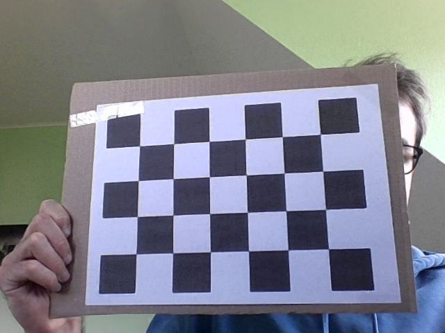
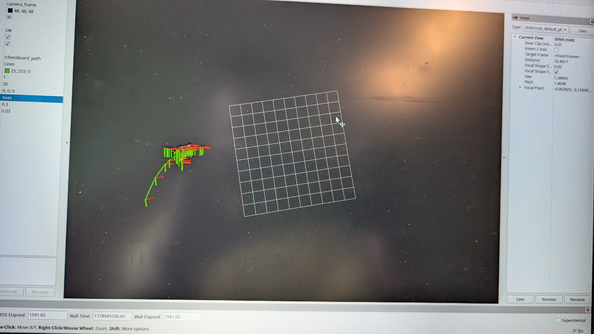

# Exercise 4 - OpenCV Camera Calibration

This directory contains the final submission for AMS Exercise 4 by Ken
Schlesiger and Luis Alvarez. The solution calibrates a webcam with OpenCV,
saves a distorted/undistorted image pair, estimates extrinsic parameters for
multiple chessboard observations, and publishes a live pose and trajectory in
ROS2 for visualization in RViz2.

The assignment PDF was used as documentation input for this README. It is not
included here so the final folder stays focused on the runnable submission.

## Repository Layout

| Path | Purpose |
| --- | --- |
| `src/calibrate.cc` | OpenCV calibration program. It detects the chessboard, stores selected samples, computes intrinsics/distortion/extrinsics, and saves the image pair. |
| `src/pose.cc` | Live pose program. It undistorts the camera stream, detects the chessboard, estimates pose with `solvePnP`, overlays the pose, and publishes ROS2 pose/path/TF data. |
| `assets/calibration/` | Saved distorted and undistorted calibration images. |
| `assets/rviz/` | RViz2 screenshots showing the path visualization and display settings. |
| `results/calibration_parameters.md` | Intrinsic matrix, distortion coefficients, and per-image extrinsic parameters. |
| `CMakeLists.txt` | Build configuration for both executables. |
| `package.xml` | ROS2 package metadata for an `ament_cmake` build. |

## Build

Source the ROS2 installation first, then build from this directory. On this
machine the available ROS2 distribution is Jazzy:

```bash
cd camera_calibration
source /opt/ros/jazzy/setup.bash
mkdir -p build
cd build
cmake ..
make -j8
```

If a different ROS2 distribution is used, replace the `source` line with the
matching setup file, for example `/opt/ros/humble/setup.bash`.

The build creates two executables:

```bash
./calibrate
./pose
```

If the default camera index does not open, pass the camera id explicitly:

```bash
./calibrate 0
./pose 0
```

## Calibration Program

`calibrate.cc` implements the intrinsic and extrinsic calibration workflow:

1. open the camera stream at 640x480,
2. detect a `4 x 6` inner-corner chessboard,
3. refine corners with `cornerSubPix`,
4. store calibration samples when requested,
5. run `calibrateCamera`,
6. print the camera matrix, distortion coefficients, and one extrinsic pose per
   stored sample,
7. undistort the live image,
8. save `distorted.png` and `undistorted.png`.

Controls:

| Key | Action |
| --- | --- |
| `i` | Store the current frame as a calibration sample, but only when the chessboard is detected. |
| `SPACE` | Stop collecting samples and start calibration. |
| `s` | Save the current distorted and undistorted image pair. |
| `ESC` | Exit. |

The saved calibration images are:




## Calibration Results

The intrinsic matrix is:

```text
[660.0381836895866, 0, 315.952445979791;
 0, 660.1702745351153, 229.9783072067786;
 0, 0, 1]
```

The distortion coefficients are:

```text
[0.0774595326694079, -0.9822995703352496,
 0.001853001111686757, 0.0004869717236538896,
 2.010310818542591]
```

The full per-image extrinsic output is stored in
[`results/calibration_parameters.md`](results/calibration_parameters.md).

## Pose Program

`pose.cc` uses the calibration above for live pose estimation. Each frame is
undistorted, the chessboard is detected, and `solvePnP` estimates the pose from
the 3D board points and 2D image points. The program writes roll, pitch, yaw,
and translation onto the image with `cv::putText`.

The ROS2 output is:

| Output | Name |
| --- | --- |
| Node | `pose_publisher` |
| Pose topic | `/camera_pose` |
| Path topic | `/chessboard_path` |
| Parent frame | `camera_frame` |
| Child frame | `chessboard` |

Run it with:

```bash
cd camera_calibration/build
./pose 0
```

Useful checks:

```bash
ros2 topic list
ros2 topic echo /camera_pose
ros2 topic echo /chessboard_path
rviz2
```

In RViz2, set the fixed frame to `camera_frame`, add a `Path` display for
`/chessboard_path`, and add TF or pose displays as needed. The submitted RViz2
configuration used a green path with axes-style poses.




## Pose Representations

OpenCV's calibration and pose-estimation functions mainly operate with:

- Rodrigues rotation vectors plus translation vectors (`rvec`, `tvec`),
- `3 x 3` rotation matrices obtained through `cv::Rodrigues`,
- homogeneous transformations represented manually as matrices when needed.

OpenCV does not provide a direct high-level Euler-angle or quaternion pose type
for this workflow. In this solution, Euler angles are computed from the rotation
matrix for printing, while `tf2` converts the rotation matrix to a quaternion
for ROS2 messages and TF.

## Notes

The translation output is in chessboard-square units because the object points
are generated with one unit per square. To express translation in meters, scale
the 3D chessboard points by the real printed square size before calibration and
pose estimation.

If another camera, resolution, or chessboard pattern is used, regenerate the
calibration and update the hardcoded intrinsics and distortion coefficients in
`src/pose.cc`.
