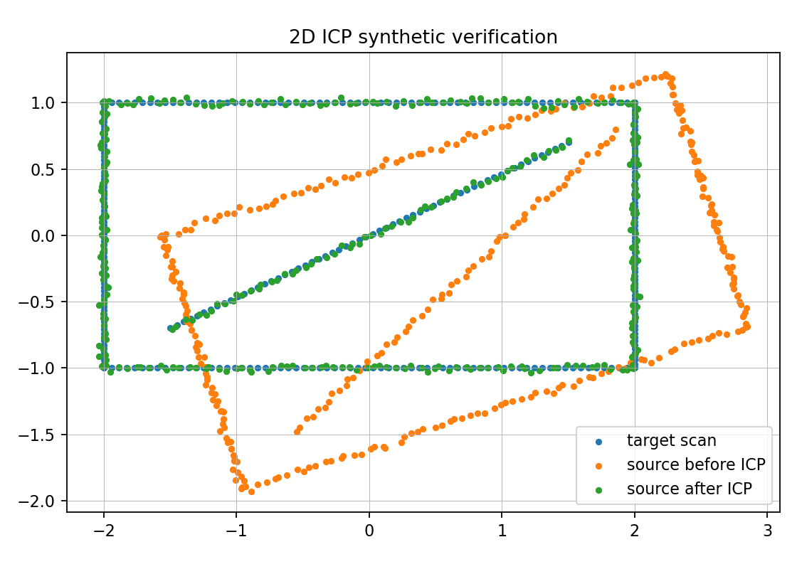

# ICP Scan Matching

This directory contains the code-centered submission material for AMS Exercise
9. The assignment asks for a self-implemented 2D ICP algorithm that matches
consecutive or every n-th laser scan and publishes an accumulated meta scan.

The final package is a ROS2 Python package named `icp_scan_matching`. It
subscribes to `LaserScan` and `Odometry`, aligns scans with a custom
point-to-point ICP implementation, and publishes the accumulated result as a
`PointCloud2` on `/meta_scan`.

The exercise PDF was used as context for this README. The final folder keeps
the runnable source and verification material.

## Layout

| Path | Purpose |
| --- | --- |
| `icp_scan_matching/icp_node.py` | ICP implementation, ROS2 node, meta-scan publisher, and synthetic demo mode. |
| `launch/icp_launch.py` | Launch file with topic remapping and ICP parameters. |
| `assets/icp_synthetic_demo.png` | Synthetic verification plot produced by the script. |
| `package.xml` | ROS2 package metadata. |
| `setup.py` | Python package installation and `icp_node` console entry point. |
| `requirements.txt` | Python dependencies for local/demo execution. |

## Build

On this machine the available ROS2 distribution is Jazzy:

```bash
cd icp_scan_matching
source /opt/ros/jazzy/setup.bash
colcon build --packages-select icp_scan_matching
source install/setup.bash
```

If the package is copied into a larger workspace, run the same `colcon build`
from that workspace root.

## Run With a Bag

Run the ICP node:

```bash
ros2 launch icp_scan_matching icp_launch.py
```

Then play a bag in another terminal:

```bash
ros2 bag play /path/to/rosbag
```

If the bag uses different topic names:

```bash
ros2 launch icp_scan_matching icp_launch.py \
  scan_topic:=/scan \
  odom_topic:=/odom \
  meta_scan_topic:=/meta_scan
```

In RViz2, set the fixed frame to `map` and add a `PointCloud2` display for
`/meta_scan`.

## Important Parameters

| Parameter | Meaning | Default |
| --- | --- | ---: |
| `max_iterations` | Maximum ICP iterations per scan pair. | `60` |
| `tolerance` | RMSE change threshold for convergence. | `1e-5` |
| `max_correspondence_distance` | Reject point pairs farther than this distance. | `0.5` |
| `min_correspondences` | Minimum accepted nearest-neighbor pairs. | `12` |
| `match_every_n_scans` | Use every n-th scan instead of every scan. | `1` |
| `publish_every_n_scans` | Publish accumulated cloud every n accepted scans. | `5` |
| `beam_stride` | Downsample beams before ICP. | `2` |
| `voxel_size` | Downsample the accumulated meta scan. | `0.03` |
| `max_meta_points` | Hard cap for accumulated points. | `200000` |
| `frame_id` | Frame used for the published meta scan. | `map` |

The most sensitive parameter is `max_correspondence_distance`: too small means
ICP finds too few pairs; too large means unrelated walls/corners can be paired.

## Algorithm

The ICP implementation is custom. It uses SciPy's `KDTree` only for nearest
neighbor lookup, not as an ICP package.

For each selected scan:

1. invalid laser ranges (`inf`, `nan`, below min, above max) are removed,
2. scan points are converted from polar laser coordinates to 2D Cartesian
   points,
3. odometry provides the initial map-frame guess,
4. nearest neighbors are found in the previous aligned scan,
5. pairs beyond `max_correspondence_distance` are rejected,
6. the best rigid 2D transform is computed with SVD,
7. the source scan is transformed and the process repeats until convergence,
8. the aligned scan is inserted into the accumulated meta scan,
9. the meta scan is voxel-downsampled and published as `PointCloud2`.

## Verification

The script includes a synthetic demo that does not require ROS2:

```bash
python3 icp_scan_matching/icp_node.py \
  --demo \
  --demo-output assets/icp_synthetic_demo.png
```

The current verification converges in 22 iterations with an RMSE around
`0.019 m` on the synthetic data.



## Fixes Compared to the Original Script

The original `icp_py.py` was kept as the starting point but the final version
fixes the practical failure points:

- converts scan lists into stable `numpy` arrays,
- rejects invalid ranges,
- uses the correct number of source points when building correspondences,
- adds a maximum point-to-point correspondence distance,
- computes the rigid transform with a standard SVD/Kabsch step,
- avoids unbounded meta-scan growth with voxel downsampling and a hard cap,
- publishes `PointCloud2` only after valid accumulated scans exist,
- exposes ROS2 parameters and topic remappings through a launch file.

