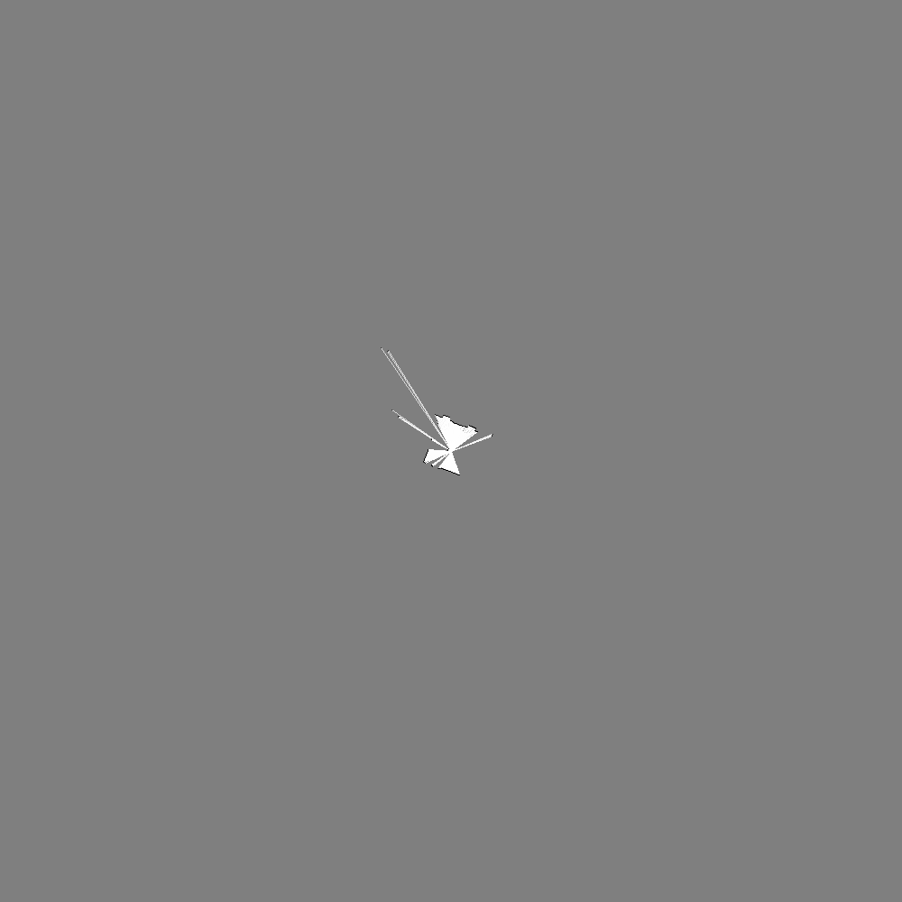
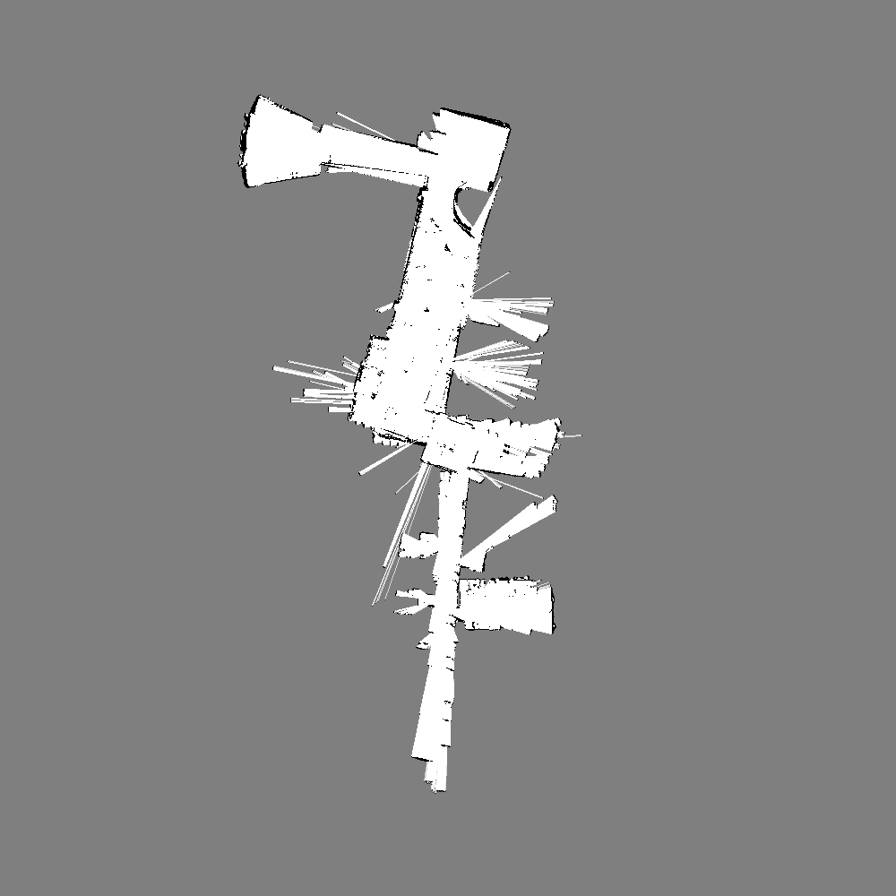
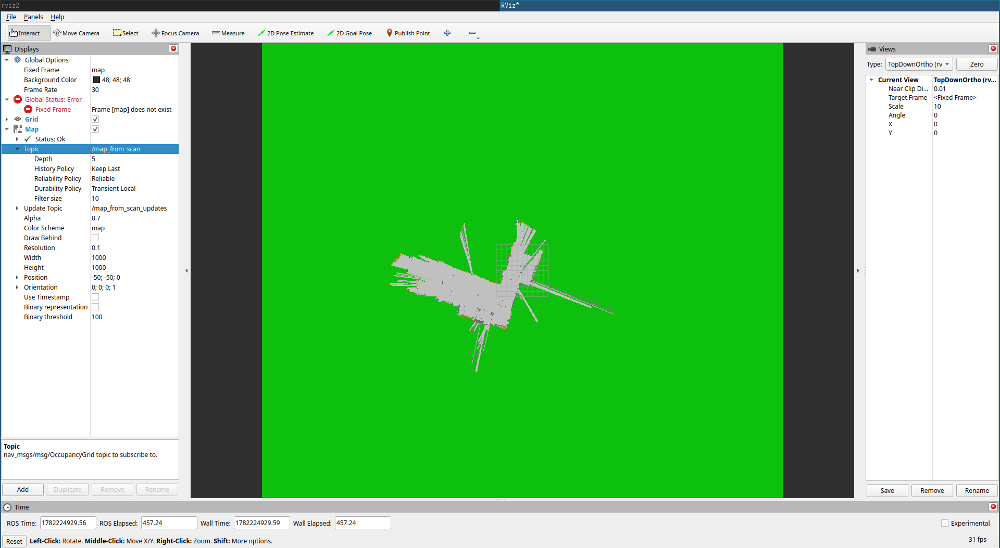
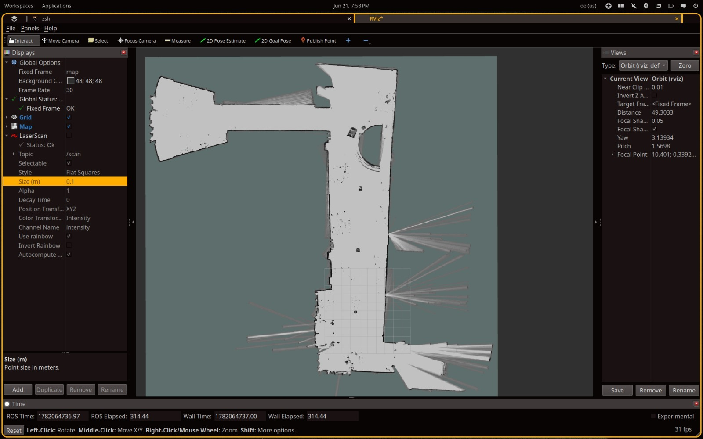

# Laser Scan Mapping

This directory contains the code-centered submission material for AMS Exercise
8. The assignment covered SLAM, but the implemented part here is the custom
mapping pipeline with known poses: a ROS2 node consumes 2D laser scans and
odometry, updates a probabilistic occupancy grid stored in a C++ array, writes
the map as a Netpbm PPM image, and publishes it as a ROS2 `OccupancyGrid` for
RViz2.

The exercise PDF was used as context for this README. The final folder keeps
the runnable source files, generated maps, and visual evidence.

## Layout

| Path | Purpose |
| --- | --- |
| `src/main.cpp` | ROS2 entry point for the map-building node. |
| `src/map_build.cpp` | Laser scan integration, odometry handling, Bresenham ray tracing, PPM export, and `OccupancyGrid` publishing. |
| `include/map_build/map_build.hpp` | Node class, map constants, subscriptions, publisher, and mapping helpers. |
| `launch/mapping_launch.py` | Launches the mapper and optionally RViz2, with topic remapping arguments. |
| `maps/known_pose/final_map.ppm` | Final map produced by the custom known-pose mapper. |
| `maps/cartographer/` | Cartographer map artifacts supplied with the exercise material. |
| `assets/timesteps/` | Saved map snapshots for `t0`, `t1`, and `tmax`. |
| `assets/rviz/` | RViz2 screenshots for the custom map and Cartographer result. |

## Build

On this machine the available ROS2 distribution is Jazzy:

```bash
cd laser_scan_mapping
source /opt/ros/jazzy/setup.bash
mkdir -p build
cd build
cmake ..
make -j8
```

For normal ROS2 workspace usage:

```bash
source /opt/ros/jazzy/setup.bash
colcon build --packages-select map_build
source install/setup.bash
```

## Run

The node expects a laser scan topic and an odometry topic. By default it uses
`/scan` and `/odom`, publishes `/map_from_scan`, and writes `map.ppm` in the
current working directory.

```bash
ros2 launch map_build mapping_launch.py
```

With explicit topics and output path:

```bash
ros2 launch map_build mapping_launch.py \
  scan_topic:=/scan \
  odom_topic:=/odom \
  map_topic:=/map_from_scan \
  output_map_path:=/tmp/map_from_scan.ppm
```

When replaying a bag, run the launch file in one terminal and play the bag in
another terminal after sourcing the same ROS2 workspace.

## Implementation

The mapper keeps a `100 m x 100 m` square map with `0.10 m` cells. This gives a
`1000 x 1000` array. Each cell stores an occupancy probability:

- `0.5`: unknown,
- lower values: free space,
- higher values: occupied space.

For each synchronized-enough odometry/scan update, the node:

1. converts the robot quaternion to yaw,
2. transforms each laser beam into map coordinates using odometry,
3. marks free cells along the beam with Bresenham's line algorithm,
4. increases occupancy at the measured endpoint for valid finite ranges,
5. exports the current grid as PPM,
6. publishes the map as `nav_msgs/msg/OccupancyGrid`.

The PPM export uses a conventional visualization: occupied cells are black,
free cells are white, and unknown space remains grey.

## Results

Part I required maps at `t0`, `t1`, and `tmax`:






The final PPM is stored at:

```text
maps/known_pose/final_map.ppm
```

## RViz2 Evidence

Custom known-pose map published on `/map_from_scan`:



Cartographer/SLAM result visualized in RViz2:



## Cartographer Map Files

The supplied Cartographer map from the recorded bag is included as:

```text
maps/cartographer/our_rosbag_cartographer.yaml
maps/cartographer/our_rosbag_cartographer.pgm
```

The provided `ex-2-no-odom-map.yaml` is also included as
`maps/cartographer/ex_2_no_odom_map.yaml`, but its referenced
`ex_2_no_odom_map.pgm` image was not present in the files available for this
folder. Place that PGM beside the YAML before loading it with ROS2 map tools.

## RViz2 Setup

In RViz2:

- set the fixed frame to `map`,
- add a `Map` display for `/map_from_scan`,
- add a `LaserScan` display for `/scan` if the bag is still playing,
- use a top-down orthographic view for screenshots.

