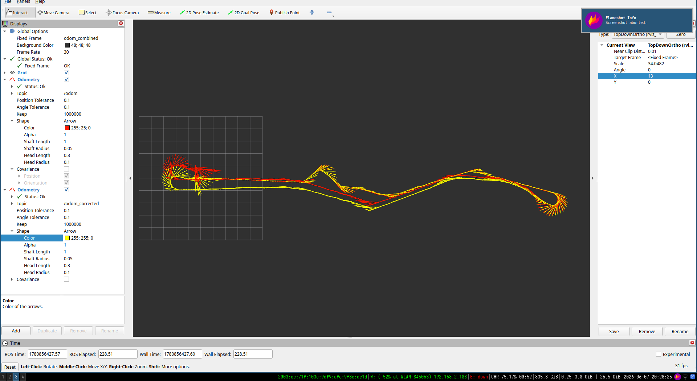
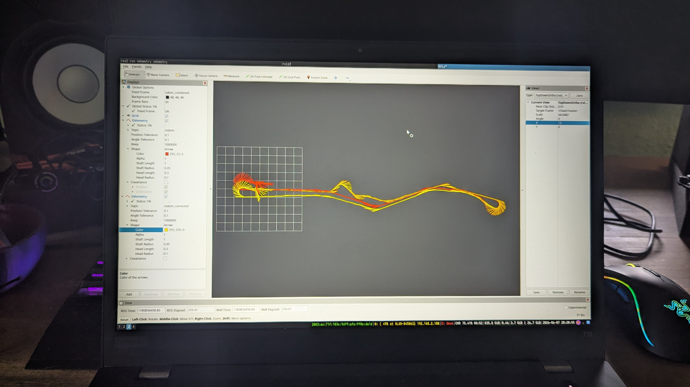
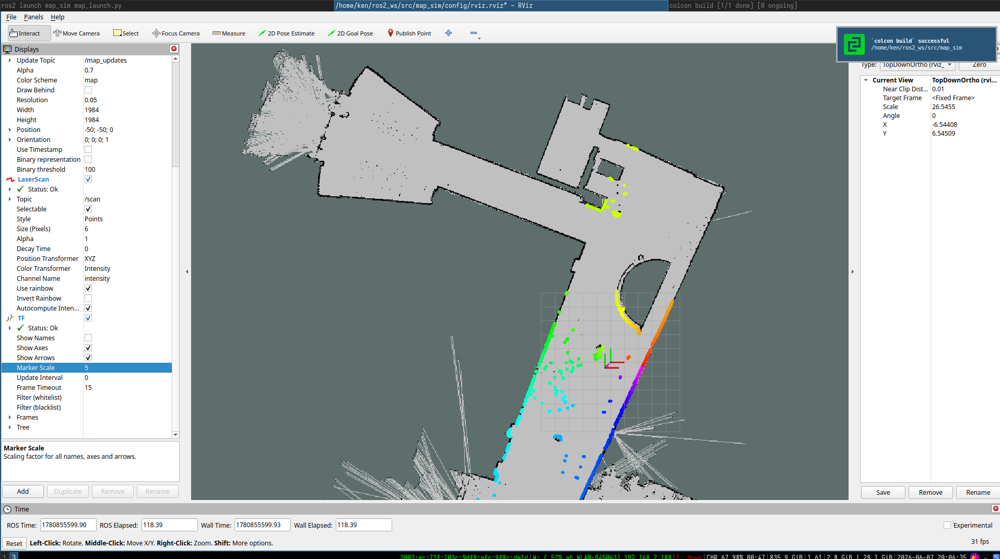
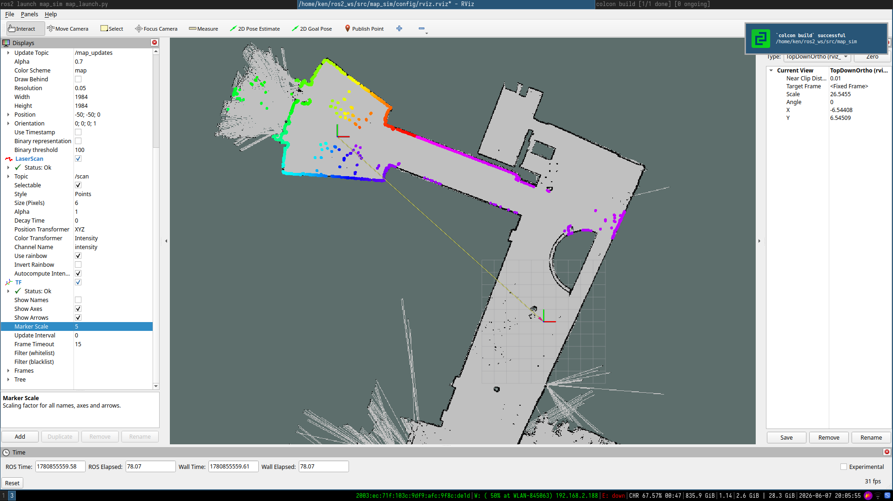
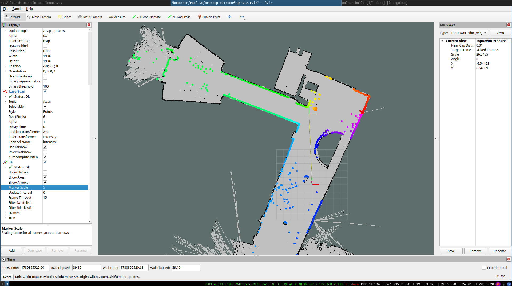

# Odometry and Laser Map Simulation

This directory contains the code-centered material for AMS Exercise 7. The
assignment covered odometry correction, laser scan simulation on an occupancy
grid map, and AMCL. The files provided here focus on the implemented and
reproducible parts: the odometry comparison evidence and a ROS2 laser simulator
that ray-casts through a map with Bresenham's line algorithm.

## Layout

| Path | Purpose |
| --- | --- |
| `src/main.cpp` | ROS2 entry point for the simulator node. |
| `src/map_sim.cpp` | Occupancy-grid ray-casting simulator. |
| `include/map_sim/map_sim.hpp` | Node class, map state, scan publisher, and Bresenham interface. |
| `launch/map_launch.py` | Launches Nav2 map server, lifecycle manager, simulator node, and RViz2. |
| `assets/odometry/` | Part I RViz evidence comparing original and corrected odometry. |
| `assets/laser_simulation/` | Part II screenshots of simulated laser scans from different map poses. |

The original exercise PDF was used only as documentation context. The final
folder keeps the submission focused on source files and produced results.

## Build

On this machine the available ROS2 distribution is Jazzy:

```bash
cd odometry_laser_mapping
source /opt/ros/jazzy/setup.bash
mkdir -p build
cd build
cmake ..
make -j8
```

This builds:

```bash
./map_sim_node
```

For normal ROS2 usage, put this folder in a ROS2 workspace and build it with
`colcon`, then source the workspace:

```bash
source /opt/ros/jazzy/setup.bash
colcon build --packages-select map_sim
source install/setup.bash
```

## Run With a Map

The simulator subscribes to the `map` topic as a `nav_msgs/msg/OccupancyGrid`,
publishes a synthetic `sensor_msgs/msg/LaserScan` on `/scan`, and publishes the
TF transform from `map` to `laser`.

Launch it with a map YAML:

```bash
ros2 launch map_sim map_launch.py map_yaml:=/path/to/allhallwaygmapping.yaml
```

Useful launch parameters:

| Parameter | Meaning | Default |
| --- | --- | ---: |
| `laser_pose_x_cells` | Laser x position in map cells. | `992.0` |
| `laser_pose_y_cells` | Laser y position in map cells. | `992.0` |
| `laser_pose_theta` | Laser yaw in radians. | `0.0` |
| `angle_increment_deg` | Angular spacing between simulated beams. | `0.05` |
| `range_max_m` | Maximum simulated range in meters. | `100.0` |
| `use_rviz` | Start RViz2 together with the nodes. | `true` |

Example with a different laser pose:

```bash
ros2 launch map_sim map_launch.py \
  map_yaml:=/path/to/allhallwaygmapping.yaml \
  laser_pose_x_cells:=1300 \
  laser_pose_y_cells:=992 \
  laser_pose_theta:=1.57
```

## Implementation Notes

`map_sim` waits for the occupancy grid from the map server. Once a map is
available, it generates a 360-degree laser scan every 100 ms.

For each beam:

1. the beam endpoint is computed from the laser pose and max range,
2. Bresenham's line algorithm walks through the map cells,
3. the first occupied or unknown cell is treated as the hit point,
4. the hit distance is converted back to meters and stored in the scan message.

Cells with occupancy values above `50`, unknown cells with value `-1`, and
out-of-map cells are treated as obstacles.

## Odometry Evidence

Part I asked for a visual comparison between the original trajectory and an
improved trajectory. The submitted RViz views show `/odom` and
`/odom_corrected` in the `odom_combined` frame.





The odometry parameters that matter most for reducing drift are the wheel
radius or wheel-diameter scale, the wheel separation/baseline, and the encoder
tick-to-distance conversion. The radius/tick scale mainly changes travelled
distance; the wheel separation mainly changes the estimated rotation during
turns.

## Laser Simulation Evidence

The following screenshots show the simulated laser scan on the basement map
from three different poses:







## RViz2 Setup

In RViz2, use the map frame as fixed frame and add:

- `Map` display for `/map` or `/map_updates`,
- `LaserScan` display for `/scan`,
- `TF` display to see the `map -> laser` transform.

The screenshots use a top-down orthographic view, a grey occupancy map, and a
rainbow/intensity coloring for the laser scan points.

